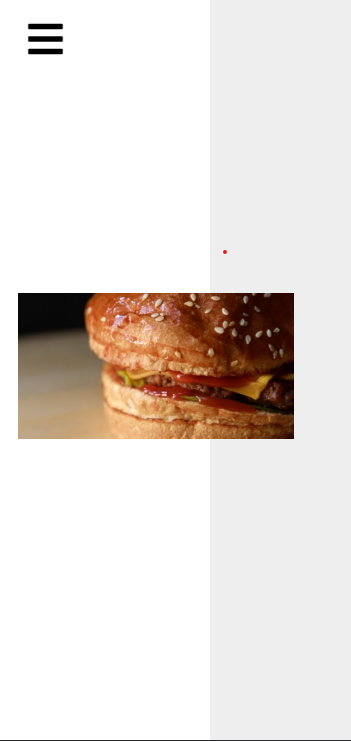
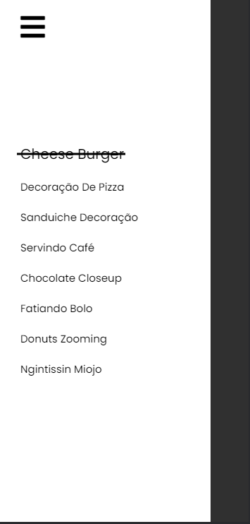
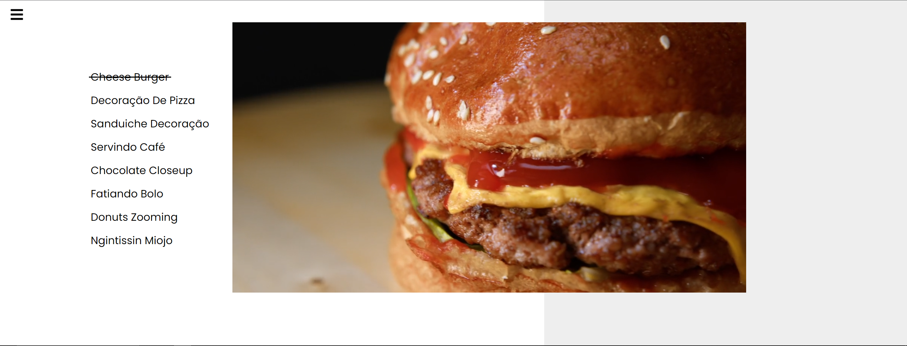

<h1>Landing-Page-Video</h1>

<h1 align="center">
    
</h1>

## 💻 Sobre o projeto

Esse é um Projetinho onde brinco com videos dentro da "li" junto com o data-src e bricando com animações no css e terminando uns detalhes com JavaScript 

<h3 align="center">
    <a href="https://wesleipossidonio.github.io/Landing-Page-Video/">Acessar a demonstração</a>
<h3 >

### Mobile

  
   

### Web

  

## 🛠 Tecnologias

As seguintes ferramentas foram usadas na construção do projeto:

- [x] HTML
- [x] CSS
- [x] JavaScript

## 📝 Licença

Este projeto esta sobe a licença MIT.

Feito com ❤️ por Weslei França 👋🏽 [Entre em contato!](https://www.linkedin.com/in/wesleifranca/)

